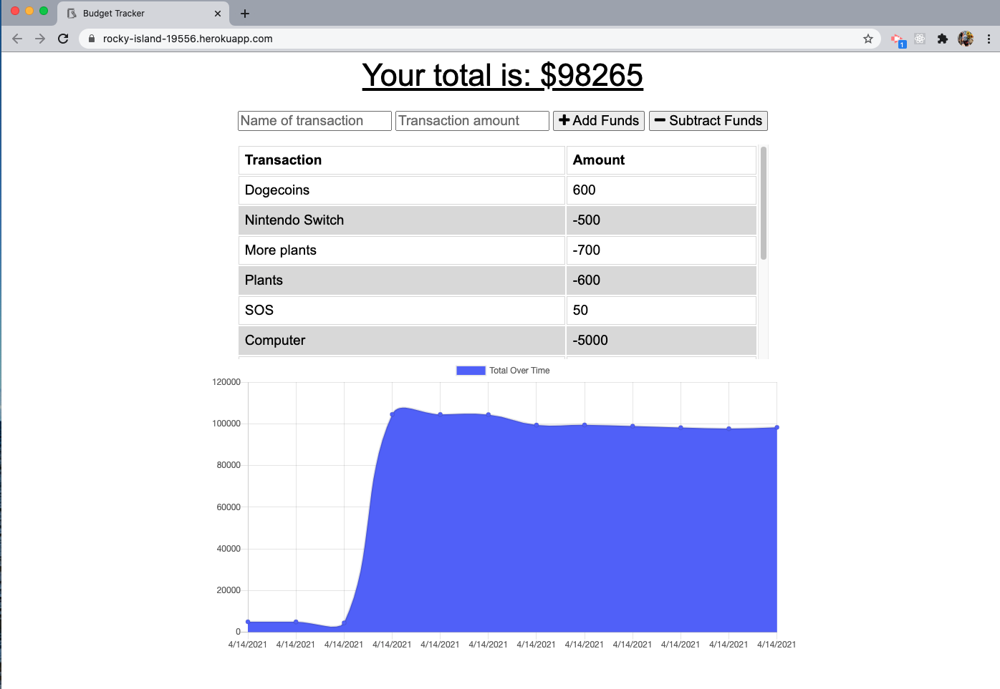
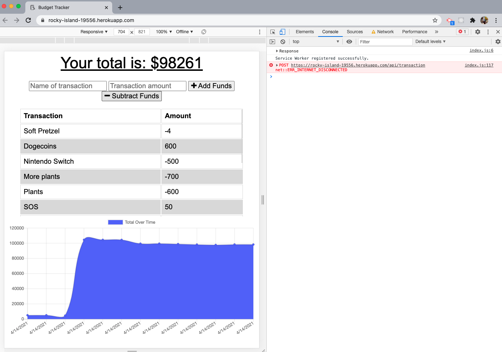
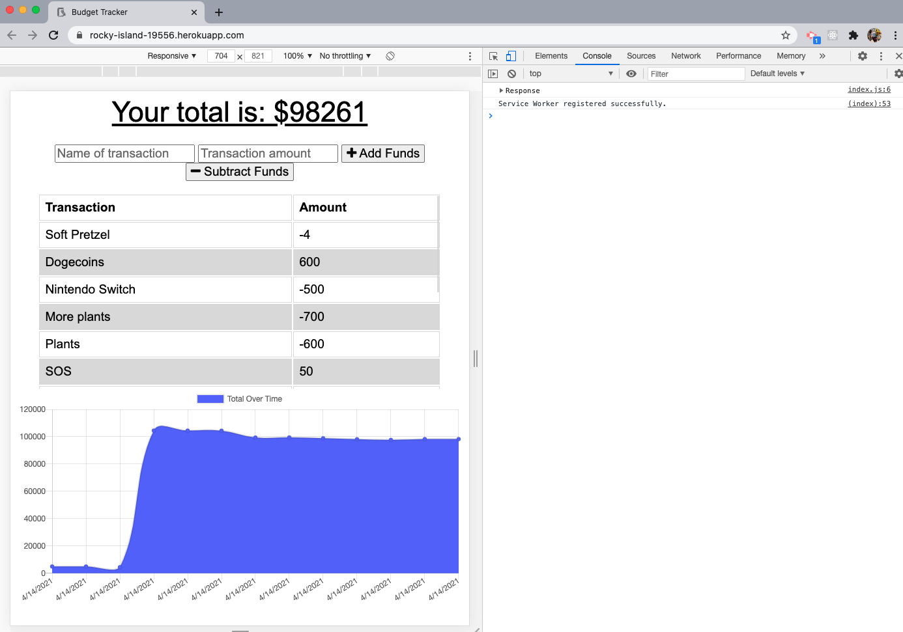

# Unit 18 PWA Homework: Online/Offline Budget Trackers

## Description 

Tasked with creating adding functionality to the existing Budget Tracker application to allow for offline access and functionality, using a service-worker.js and manifest.

---

## User Story

* AS AN avid traveller
* I WANT to be able to track my withdrawals and deposits with or without a data/internet connection
* SO THAT my account balance is accurate when I am traveling

---

## Development 

Public, model & routes folders were provided as well as a server.js file that needed to be adjusted.  

* Provided files changed
  * server.js - allowing for process.env & mongoose to be used 
  * api.js & index.js - console logs added 
* New files added
  * db.js - holds indexedDB, which is the database within the browser
  * service-worker.js - allows offline functionality 
  * manifest.webmanifest - provides PWA info
* DB
  * Created budgetdb + transactions collection
  * Using MongoDB Atlas with account and process.env used with Heroku
* Offline Functionality:
  * Enter deposits offline
  * Enter expenses offline
  * When brought back online -> offline entries should be added to tracker.

---

## Installation 

NPM install for express, mongoose, morgan, compression & lite-server - other files required throughout the app once they are created. Ensure these are listed on package.json as dependencies.

--- 

## Preview 

--

--

---
## Heroku Link 

https://rocky-island-19556.herokuapp.com/

---

## Github Link

https://github.com/vshulman25/BudgetTracker

---

## Credits

Developer - Victoria Shulman 
